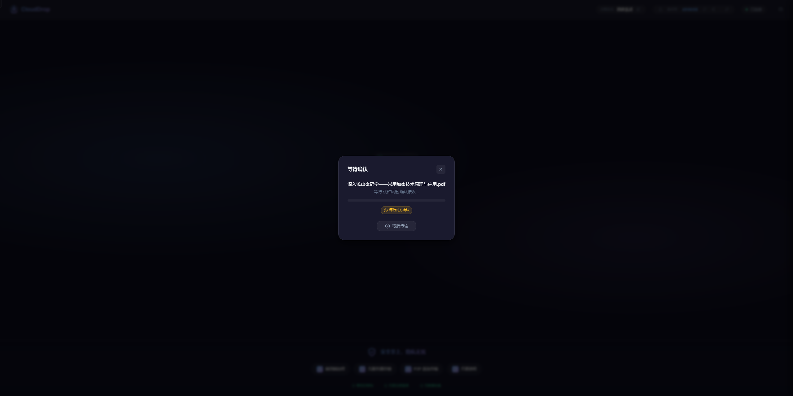
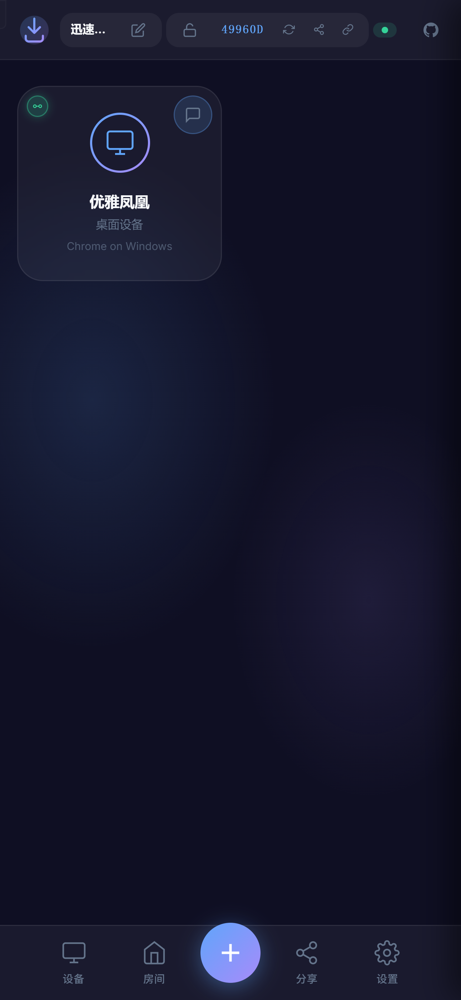
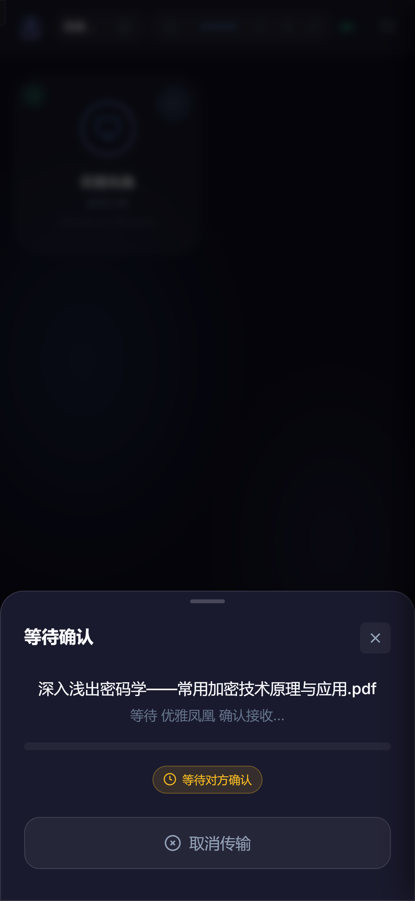

# CloudDrop

<p align="center">
  
</p>

<p align="center">
  <strong>现代化、安全的点对点文件共享工具，基于 Cloudflare Workers 构建。</strong>
</p>

<p align="center">
  <a href="./README.md">🇺🇸 English</a> •
  <a href="#特性">特性</a> •
  <a href="#部署">部署</a> •
  <a href="#开发">开发</a>
</p>

<p align="center">
  
  
  
</p>

---

## ✨ 特性

### 核心功能
- 🚀 **即时分享** - 同一网络内的设备即时发现，快速传输
- 🔒 **端到端加密** - 使用 AES-256-GCM 加密所有传输
- 🌐 **点对点传输** - 通过 WebRTC 直接传输，无服务器存储
- ☁️ **Cloudflare 驱动** - 基于 Cloudflare Workers 全球边缘部署
- 📱 **渐进式 Web 应用** - 可安装为原生应用
- 🔗 **房间分享** - 通过房间号与任何人连接
- 💬 **安全消息** - 设备间发送加密文本消息
- 🎨 **精美界面** - 现代深色主题，毛玻璃效果，流畅动画

### 高级功能
- 🔐 **加密房间** - 创建密码保护的房间，双重加密
- 🔄 **智能中继降级** - P2P 连接失败时自动降级到中继模式（≤5秒检测）
- 🔁 **后台 P2P 恢复** - 降级后静默尝试恢复 P2P 连接
- ✅ **设备信任** - 信任的设备自动接收文件
- ⏹️ **传输控制** - 随时取消进行中的传输
- 📊 **连接模式指示** - 可视化显示 P2P 或中继模式
- 📲 **移动端优化** - 触摸友好的 UI，底部导航栏
- 🖼️ **图片消息** - 在聊天中发送和接收图片
- 🌍 **多语言支持** - 支持 9 种语言（简体中文、繁體中文、English、日本語、한국어、Español、Français、Deutsch、العربية）

## 🖼️ 截图

<table>
  <tr>
    <td align="center">
      
      <br><em>桌面端 - 设备发现</em>
    </td>
    <td align="center">
      
      <br><em>桌面端 - 文件传输</em>
    </td>
  </tr>
  <tr>
    <td align="center">
      
      <br><em>移动端 - 主界面</em>
    </td>
    <td align="center">
      
      <br><em>移动端 - 文件传输</em>
    </td>
  </tr>
</table>

## 🚀 一键部署

将 CloudDrop 部署到您自己的 Cloudflare Workers：

[](https://deploy.workers.cloudflare.com/?url=https://github.com/DeH40/cloudDrop)

## 🛠️ 开发

### 前置要求

- [Node.js](https://nodejs.org/) (v18+)
- [Cloudflare 账户](https://dash.cloudflare.com/sign-up)（免费套餐即可）

### 本地开发

```bash
# 克隆仓库
git clone https://github.com/DeH40/cloudDrop.git
cd cloudDrop

# 安装依赖
npm install

# 启动开发服务器
npm run dev
```

开发服务器将在 `http://localhost:8787` 启动。

### 部署到生产环境

```bash
# 登录 Cloudflare（仅首次需要）
npx wrangler login

# 部署
npm run deploy
```

## ⚙️ 配置

### 可选：TURN 服务器（用于 NAT 穿透）

为了在受限网络中获得更好的连接性，您可以配置 Cloudflare 的 TURN 服务：

1. 从 [Cloudflare Dashboard](https://dash.cloudflare.com/?to=/:account/calls) 获取 TURN 凭证
2. 将密钥添加到您的 Worker：

```bash
npx wrangler secret put TURN_KEY_ID
npx wrangler secret put TURN_KEY_API_TOKEN
```

未配置 TURN 时，CloudDrop 将使用公共 STUN 服务器进行 WebRTC 连接。

## 📁 项目结构

```
cloudDrop/
├── public/              # 静态资源
│   ├── index.html       # 主 HTML 文件
│   ├── style.css        # 样式（深色主题 + 毛玻璃效果）
│   ├── manifest.json    # PWA 清单
│   └── js/
│       ├── app.js       # 主应用逻辑
│       ├── config.js    # 统一配置常量
│       ├── ui.js        # UI 组件和辅助函数
│       ├── webrtc.js    # WebRTC + 中继降级 + P2P 恢复
│       ├── crypto.js    # 加密（AES-GCM + 房间密码）
│       └── i18n.js      # 国际化（9 种语言）
├── src/
│   ├── index.ts         # Worker 入口
│   └── room.ts          # WebSocket 房间的 Durable Object
├── wrangler.toml        # Cloudflare Workers 配置
└── package.json
```

## 🔧 技术栈

- **运行时**: Cloudflare Workers + Durable Objects
- **实时通信**: WebSocket 用于信令
- **文件传输**: WebRTC Data Channels (P2P) + WebSocket 中继（备用）
- **加密**: Web Crypto API (AES-256-GCM, ECDH 密钥交换)
- **前端**: 原生 JavaScript + 现代 CSS
- **国际化**: 9 种语言，自动检测

## 🔒 安全性

CloudDrop 实现了多层安全保护：

1. **传输加密** - 所有 WebRTC 连接使用 DTLS
2. **应用加密** - 使用会话密钥的 AES-256-GCM
3. **密钥交换** - ECDH (P-256) 安全密钥协商
4. **房间密码** - 可选的密码保护，使用 PBKDF2 派生
5. **零知识架构** - 服务器永远不会看到文件内容或加密密钥

## 📄 许可证

[MIT](./LICENSE) © DeH40

---

<p align="center">
  用 ❤️ 打造无缝文件分享体验
</p>
